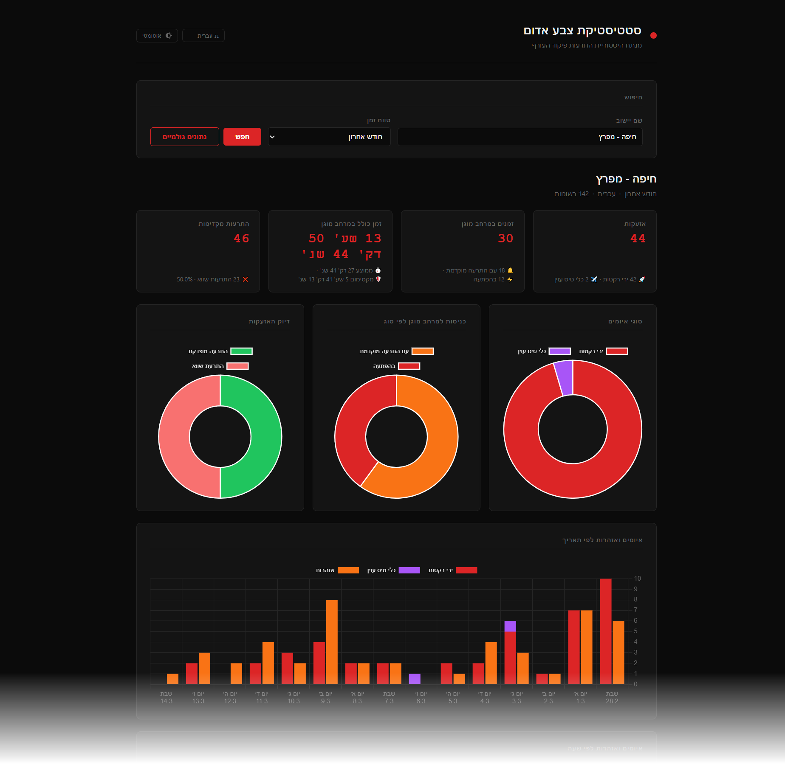

# Red Alert Stats

A small Python project for analyzing **Red Alert (Home Front Command)** alert history by city.

It includes:
- A Flask web app to generate a visual report.
- A CLI analyzer for terminal-based analysis and JSON import/export.

## Features

- Fetches alert history from the Home Front Command alerts-history API.
- Four query modes: past 24 hours, past week, past month, or a custom date range.
- Analyzes threat periods (from threat start to all-clear).
- Computes warning quality metrics:
  - true positives
  - false positives
  - false positive ratio
  - average warning lead time
- Tracks shelter duration metrics:
  - total, average, and max duration
  - periods with and without head-up warnings
- Supports multiple API languages: `he`, `en`, `ru`, `ar`.
- Web report with sortable timeline-style output.

## Screenshot



## Requirements

- Python 3.11+ recommended
- Dependencies listed in `requirements.txt`

## Setup

### Using scripts

#### Bash (Linux/macOS)

```bash
./setup.sh
```

#### PowerShell (Windows)

```powershell
.\setup.ps1
```

### Manual setup

#### Bash (Linux/macOS)

```bash
python3 -m venv .venv
source .venv/bin/activate
pip install -r requirements.txt
```

#### PowerShell (Windows)

```powershell
python -m venv .venv
.venv\Scripts\Activate.ps1
pip install -r requirements.txt
```

## Run The Web App

### Using scripts

#### Bash (Linux/macOS)

```bash
./run.sh [--host HOST] [--port PORT] [--debug]
```

#### PowerShell (Windows)

```powershell
.\run.ps1 [--host HOST] [--port PORT] [--debug]
```

### Manual run

#### Bash (Linux/macOS)

```bash
source .venv/bin/activate
python app.py [--host HOST] [--port PORT] [--debug]
```

#### PowerShell (Windows)

```powershell
.venv\Scripts\Activate.ps1
python app.py [--host HOST] [--port PORT] [--debug]
```

### Server options

| Flag | Default | Description |
|------|---------|-------------|
| `--host` | `localhost` | Host/IP to bind to. Use `0.0.0.0` to expose on all interfaces. |
| `--port` | `5000` | Port to listen on. |
| `--debug` | off | Enable Flask debug mode with auto-reload. |

Examples:

```bash
./run.sh --port 8080
./run.sh --host 0.0.0.0 --debug
```

```powershell
.\run.ps1 --port 8080
.\run.ps1 --host 0.0.0.0 --debug
```

Then open:
- http://localhost:5000

Use the form to choose:
- City name
- Time range (see modes below)
- Language

Notes:
- City name must match the selected language used by the API.
- The default time range is **Past month**.

### Time range modes

| Mode | Description |
|------|-------------|
| Past 24 hours | Last 24 hours of alerts |
| Past week | Last 7 days of alerts |
| Past month | Last month of alerts (default) |
| Custom date range | Explicit start and end dates (`DD.MM.YYYY`). |

## CLI Usage

Basic examples:

```bash
python analyzer.py --city "תל אביב - מרכז העיר"
python analyzer.py --city "Tel Aviv - City Center" --lang en
python analyzer.py --mode 24h --city "תל אביב - מרכז העיר"
python analyzer.py --mode week --city "תל אביב - מרכז העיר"
python analyzer.py --mode month --city "תל אביב - מרכז העיר"
python analyzer.py --mode custom --from-date 01.03.2026 --to-date 10.03.2026 --city "תל אביב - מרכז העיר"
```

Available options:

| Flag | Default | Description |
|------|---------|-------------|
| `--city` | — | City name in the selected language |
| `--lang` | `he` | API language (`he`, `en`, `ru`, `ar`) |
| `--mode` | `custom` | Time range: `24h`, `week`, `month`, or `custom` |
| `--from-date` | `28.02.2026` | Start date (`DD.MM.YYYY`). Only used with `--mode custom`. |
| `--to-date` | today | End date (`DD.MM.YYYY`). Only used with `--mode custom`. |
| `--raw-output FILE` | — | Save fetched raw API data as pretty JSON |
| `--raw-input FILE` | — | Load alerts from a local JSON file instead of the API |

Example with local JSON:

```bash
python analyzer.py --raw-input data.json
```

## Project Structure

```text
analyzer.py        CLI analyzer and core analysis logic
app.py             Flask web app
requirements.txt   Python dependencies
data.json          Local/sample alert data
templates/         HTML templates
static/            CSS assets
translations/      UI strings for he, en, ru, ar
```

## Data Source

Data is fetched from the public Home Front Command alerts history endpoint:

- https://alerts-history.oref.org.il/Shared/Ajax/GetAlarmsHistory.aspx

## Disclaimer

This project is for informational and analytical purposes. Alert interpretation and safety decisions should always follow official Home Front Command guidance.
